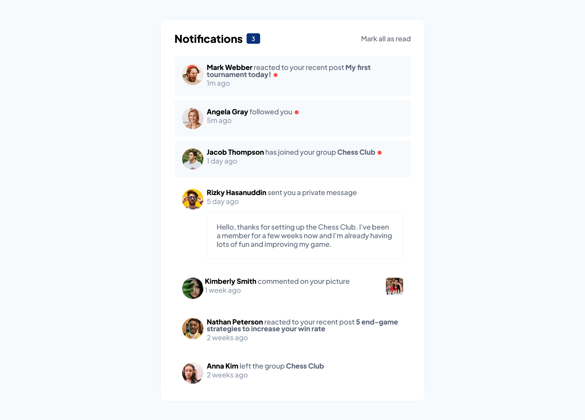
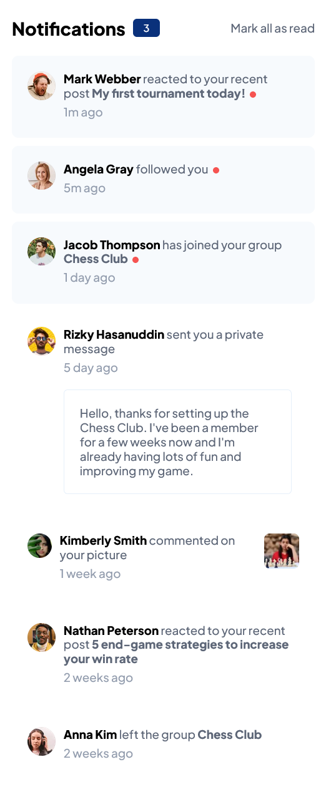

# Frontend Mentor - Solución de página de notificaciones

Esta es una solución al [desafío de la página de notificaciones en Frontend Mentor] (https://www.frontendmentor.io/challenges/notifications-page-DqK5QAmKbC). Los desafíos de Frontend Mentor lo ayudan a mejorar sus habilidades de codificación mediante la creación de proyectos realistas.

## Tabla de contenido

- [Frontend Mentor - Solución de página de notificaciones](#frontend-mentor---solución-de-página-de-notificaciones)
  - [Tabla de contenido](#tabla-de-contenido)
  - [Descripción general](#descripción-general)
    - [El reto](#el-reto)
    - [Captura de pantalla](#captura-de-pantalla)
      - [Diseño de escritorio](#diseño-de-escritorio)
      - [Diseño Móvil](#diseño-móvil)
    - [Enlaces](#enlaces)
    - [Construido con](#construido-con)
  - [Autor](#autor)

## Descripción general

### El reto

Los usuarios deberían poder:

- Distinguir entre notificaciones "no leídas" y "leídas"
- Seleccione "Marcar todo como leído" para alternar el estado visual de las notificaciones no leídas y establecer el número de mensajes no leídos en cero.
- Ver el diseño óptimo para la interfaz según el tamaño de pantalla de su dispositivo
- Ver estados de desplazamiento y enfoque para todos los elementos interactivos en la página

### Captura de pantalla

#### Diseño de escritorio

#### Diseño Móvil

### Enlaces

- URL de la solución: [GitHub](https://github.com/jean266/principal-pagina-notificiciones)
- URL del sitio en vivo: [Vercel](https://your-live-site-url.com)

### Construido con

- Caja flexible
- Cuadrícula CSS
- Flujo de trabajo móvil primero
- gulp
- sass

## Autor

- Mentor de frontend - [@jean266](https://www.frontendmentor.io/profile/jean266)
